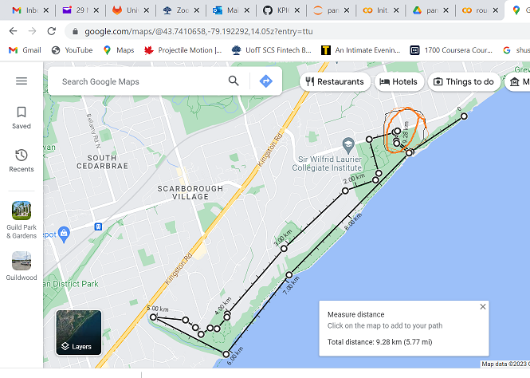
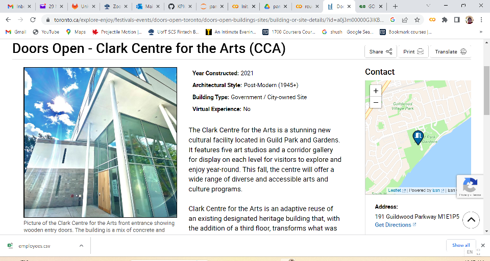
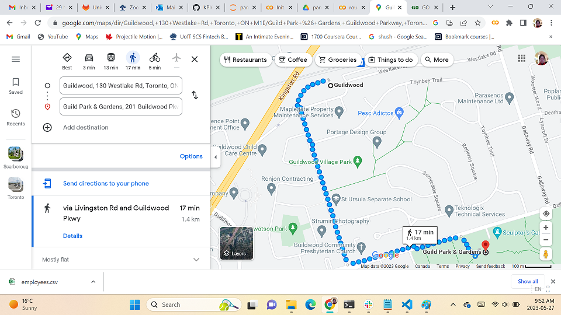
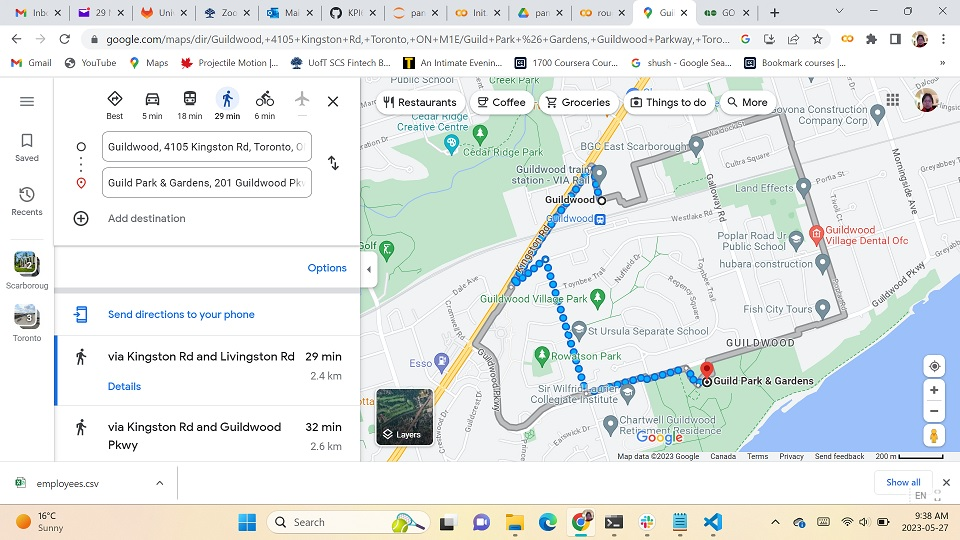

# Doors Open Toronto 2023

## 活动诚邀加盟

### 2023 年 5 月 28 日 星期日 上午 9：30

### 停车场集合

### 参观 CCA

### HIKING 大约 10 公里

## Clark Center for the Arts (CCA) at the Guild Park and Gardens
)

## Parking Plan A

## Parking Plan B
